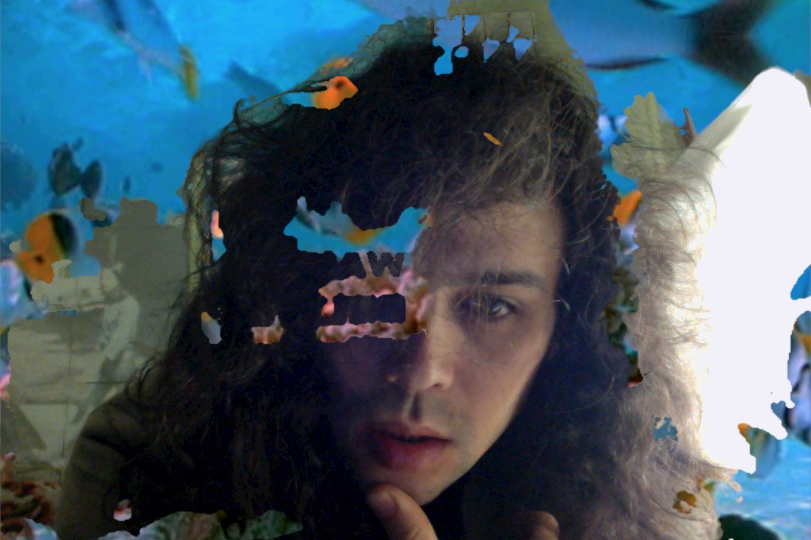

Hello! I am a software developer who lives in Brisbane, Australia and builds things on the internet and resurrects dead computer systems, and plays music ocassionally.

I'm interested in technology, the environment, and animal rights.

You can find me most active on [Twitter](https://twitter.com/phocks), [Snapchat](https://www.snapchat.com/add/phocksx), [Tumblr](http://phocks.tumblr.com), [GitHub](https://github.com/phocks), [Instagram](http://instagram.com/phocks), [Facebook](https://facebook.com/phocks), etc.

Or a plain old email would be great at [phocks@gmail.com](mailto:phocks@gmail.com)

[//]: # 

This blog is built on [Jekyll](http://jekyllrb.com/) using the [Textlog](https://github.com/heiswayi/textlog) theme, and hosted on [GitHub Pages](https://pages.github.com/).

Oh yeah and my tweet archive is [here](https://phocks.github.io/tweets/).

That's about it for now. Thanks for reading.

<!--  -->
